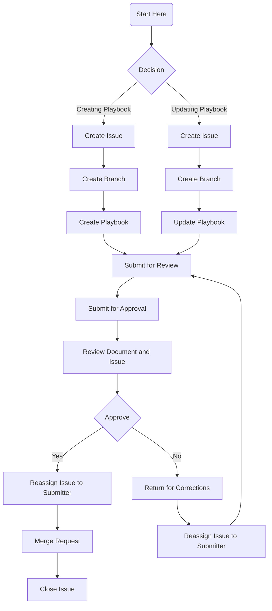

# Playbook: Playbook/Runbook Creation Process
This document is provided for informational purposes only. It represents the current product offerings and practices from Amazon Web Services (AWS) as of the date of issue of this document, which are subject to change without notice. Customers are responsible for making their own independent assessment of the information in this document and any use of AWS products or services, each of which is provided “as is” without warranty of any kind, whether express or implied. This document does not create any warranties, representations, contractual commitments, conditions, or assurances from AWS, its affiliates, suppliers, or licensors. The responsibilities and liabilities of AWS to its customers are controlled by AWS agreements, and this document is not part of, nor does it modify, any agreement between AWS and its customers.

© 2021 Amazon Web Services, Inc. or its affiliates. All Rights Reserved. This work is licensed under a Creative Commons Attribution 4.0 International License.

This AWS Content is provided subject to the terms of the AWS Customer Agreement available at http://aws.amazon.com/agreement or other written agreement between the Customer and either Amazon Web Services, Inc. or Amazon Web Services EMEA SARL or both.

[[_TOC_]]

## POINTS OF CONTACT

Author: `Author Name` \
Approver: `Approver Name` \
Last Date Approved: 3/25/2021

## NIST 800-61r2 Phase

Preparation  

## Executive Summary
This playbook outlines the process to create a new playbook/runbook, transition the document from DRAFT to APPROVED, and re-validation requirements using GitLab.  

For more advanced playbook creation, please reference the [AWS Incident Response Playbooks Workshop](https://gitlab.aws.dev/fredski/aws-incident-response-playbooks-workshop/-/blob/main/playbooks/crypto_mining/EC2_crypto_mining.md)

## Process Flow Graph

## Guidance

> It is important to maintain our runbooks to dive deep and deliver results quickly to customers. Per Matthew Helmke "Runbooks help us as a part of a wider set of practices, all designed to build reliability. Keeping runbooks up-to-date is a vital part of site reliability engineering."
(<https://www.gremlin.com/blog/ensuring-runbooks-are-up-to-date/>)  

Our team uses GitLab to manage documentation. Look at [References](../Playbook_Creation_Process.md/#references) to see some abbreviated steps for our process flow. 

## New Playbook/Runbook

### GUI Procedure

* [Create an Issue for Process Tracking](../Playbook_Creation_Process.md/#using-gitlab-create-an-issue)
* [Create a new source branch to work in](../Playbook_Creation_Process.md/#using-gitlab-create-a-branch-to-work-in)
* Navigate to the root of your branch
* Select the "Web IDE" button
* To create an item, highlight the left-margin folder and select the dropdown arrow for options
* Select "New File"
    * Note: It may be helpful to copy the content from an existing playbook for formatting
    * Our documents use [Gitlab Flavored Markdown](https://docs.gitlab.com/ee/user/markdown.html)

* Ensure follow standard naming convention for our library  
    * Playbooks: `# Playbook: Playbook/Runbook`
    * Tool Guides: `# Tooling: ToolName`
    * This is the only time Header 1 (H1) is used within the document

* Create a link to the associated issue 
    * Example: `Associate Issue: (./issues/1)`

* Once you've completed your document: 
    * Add a link to your document in the issue as a comment
    * Add the label "REVIEW" in the issue
    * Post a message with a link to your issue in the `customer correspondence mmethod` and request review/comment.  

* In order for a Playbook to be approved at least two (2) team members must have reviewed and added their names and a comment in the associated issue  

* Update and implement any recommendations or corrections to the document    

* Once your document has been reviewed and all corrections made, submit your document for the [approval process](../Playbook_Creation_Process.md/#approval-process) to be finalized.  

* Go into the issue and change the assignee to an approver
    * Go into the issue
    * Add the label SUBMITTED FOR APPROVAL to your issue
    * In the right-hand margin next to "Assignee" select "Edit"
    * Change the assignee to `approver`
    * Send a note to `approver` letting him know the document is ready for final review
    * Following approval, add a link to the document/playbook into the Readme
        * Example: `[Playbook Creation Process](./docs/Playbook_Creation_Process.md)`
    * Submit a [Merge Request](../Playbook_Creation_Process.md/#using-gitlab-create-a-merge-request)

* Note: Remember that all steps prior to the merge request MUST be completed within your working branch

* The SLA for this task is 7 calendar days from the time you submit the document.  
    * If no response has been received within the SLA period for approval, escalate by sending a chime note to `user A`, `user B`, `user C`.

### CLI Procedure
  
TBD

## Playbook/Runbook Updates

### Procedure

* [Create an Issue for Process Tracking](../Playbook_Creation_Process.md/#using-gitlab-create-an-issue)
* [Create a new source branch to work in](../Playbook_Creation_Process.md/#using-gitlab-create-a-branch-to-work-in)
* Navigate to the root of your branch
* Select the "Web IDE" button
* Open a new issue to track progress on your changes
    * Remove all existing labels
    * Add the label DRAFT
* Create a link to the associated issue 
    * `Associate Issue: (./issues/1)`
    * You can append your issue to the list
        * Example: (issue1) , (issue1) , (issue3)

* Once you've completed your document: 
    * Add a link to your document in the issue as a comment
    * Add the label "REVIEW" in the issue
    * Post a message with a link to your issue in `customer correspondence mechanism` and request review/comment.  

* In order for a Playbook to be approved at least two (2) team members must have reviewed and added their names and a comment in the associated issue  

* Update and implement any recommendations or corrections to the document    

* Once your document has been reviewed and all corrections made, submit your document for the [approval process](../Playbook_Creation_Process.md/#approval-process) to be finalized.  

* Go into the issue and change the assignee to an approver
    * Go into the issue
    * Add the label SUBMITTED FOR APPROVAL to your issue
    * In the right-hand margin next to "Assignee" select "Edit"
    * Change the assignee to `approver`
    * Send a note in Chime to `approver` letting them know the document is ready for final review
    * Following approval, add a link to the document/playbook into the Readme
        * Example: `[Playbook Creation Process](./docs/Playbook_Creation_Process.md)`
    * Submit a [Merge Request](../Playbook_Creation_Process.md/#using-gitlab-create-a-merge-request)

* Note: Remember that all steps prior to the merge request MUST be completed within your working branch

* The SLA for this task is 7 calendar days from the time you submit the document.  
    * If no response has been received within the SLA period for approval, escalate by sending a note to `user A`, `user B`, `user C`

### CLI Procedure
  
TBD

## Approval Process

### Task Owner:

Team Owners  

### Service Level Agreement

-   7 calendar days from author submission  

### Procedure

* Review the document and associated issue in GitLab

* Delete REVIEW from the title of the document  

* Delete the statement THIS IS A DRAFT PLAYBOOK from the document  

*  Under Points of Contact  
    -   Add/update your name to Approver
    -   Add/update `Last Date Approved` as YYYY/MM/DD for when you approve the document  

* Reassign the issue back to the requester
    * Add a comment in the issue that the playbook is approved, and to proceed with a merge request

## References

### Using GitLab: Create an Issue

We use issues to track ongoing and completed work. Additionally, this assists the team with transitioning through our review and approval process. This also permits comments from reviewers to address anything withing repository objects as part of our documentation bar raiser process. 

* Graphical User Interface: the GUI allows you to interact with GitLab from a web browser to interact with this repository
    1. Navigate to the [Playbook Repository](customer Git repository link here) using your favored web browser
    1. Open an issue by selecting Issues from the left-margin menu
        1. Select "New Issue"
        1. Add a title and description of what you are working on
        1. Assign to yourself (this will allow tracking in later steps)
        1. For Milestone, select `customer milestone here`
        1. For Labels, select any that are appropriate for your Issue
            * For new documents ensure you select DRAFT
        1. Select "Submit issue"
        1. On the new Issue page, in the right-hand margin Lock issue > Edit > Lock

* Command Line Interface: the CLI allows you to interact with GitLab form the command-line

### Using GitLab: Create a Branch to Work in

We work in individual branches so in progress work does not interfere with what others may be doing in real-time.

* Graphical User Interface: the GUI allows you to interact with GitLab from a web browser to interact with this repository
    1. Create a branch to work out of
        1. From the left-hand menu select "Repository" > "Branches"
        1. Select "New Branch"
        1. Enter the playbook name as the branch name. For example: `playbook-creation-draft`
        1. Select "Create Branch"

* Command Line Interface: the CLI allows you to interact with GitLab form the command-line

### Using GitLab: Create a Merge Request

Merge Request(s) allow a secondary bar raiser review prior to merging with the parent repository.

* Graphical User Interface: the GUI allows you to interact with GitLab from a web browser to interact with this repository
    1. From the root of your branch select "Create merge request"
        1. Update the title to "Merge Request from USERNAME"
        1. Update the description to reflect what you created or changed
        1. Assignee: `user A`
        1. Reviewer: `user B`
        1. Milestone: `example`
        1. Labels: any appropriate for your merge
        1. Ensure the box is check marked next to "Delete source branch when merge request is accepted"
        1. Ensure the box is check marked next to "Squash commits when merge request is accepted"
        1. Select "Submit merge request"

* Command Line Interface: the CLI allows you to interact with GitLab form the command-line
  
## Backlog Items
